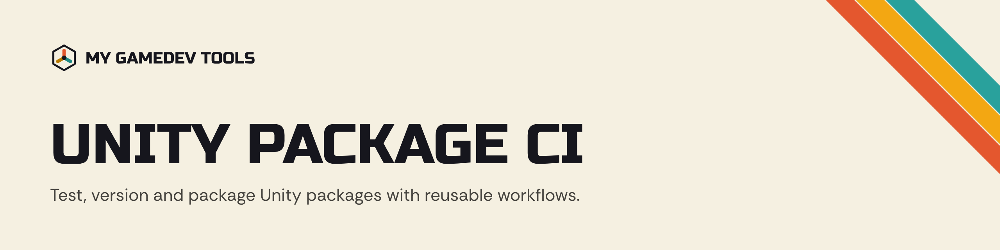

<p align="center">
  <picture>
    <source media="(prefers-color-scheme: dark)" srcset="assets/readme/banner-dark.png">
    
  </picture>
</p>

<p align="center">
  <a href="https://github.com/mygamedevtools/unity-package-ci/tags"></a>
  <a href="LICENSE"></a>
</p>

Reusable GitHub Actions workflows for My GameDev Tools Unity packages: tests across every active Unity stream, semantic versioning, and packaging into a `upm` branch, a signed UPM tarball and an optional `.unitypackage`.

Each package repository keeps only short caller workflows with its own triggers and a few inputs. The logic lives here, so a fix lands in every package at once.

## Workflows

| Workflow | Does |
|---|---|
| `test.yml` | Detects the Unity versions to test, runs the tests on each with game-ci, uploads coverage to Codecov, and opens an issue when a scheduled run fails. |
| `versioning-semver.yml` | Runs semantic-release with the standard config (or the repository's own `.releaserc.json`), then packages the new version. |
| `versioning-manual.yml` | Creates a `-pre.N` prerelease from a chosen bump type, then packages it. |
| `packaging.yml` | Builds the `upm` branch and `upm/<version>` tag, a signed UPM tarball, and optionally a `.unitypackage`, and attaches them to the release. |
| `detect-unity-versions.yml` | Resolves every active LTS stream plus the latest non-LTS stable stream to a `unityci/editor` image version. |

### Inputs

| Input | Workflows | Default | |
|---|---|---|---|
| `coverage-assemblies` | test | every assembly | Coverage assembly filter, e.g. `+MyGameDevTools.SceneLoading`. |
| `test-mode` | test | `all` | `playmode`, `editmode` or `all`. |
| `version-streams` | test | auto | Comma-separated streams to pin instead, e.g. `6000.0,6000.3`. |
| `graphics` | test | `false` | Start the editor with a graphics device. Leave it off unless a test needs rendering: the runner has no GPU, so each frame is drawn in software. |
| `package-path` | versioning, packaging | `.releaserc.json` | The package directory, e.g. `Packages/com.mygamedevtools.my-package`. Empty reads `pkgRoot` from the repository's `.releaserc.json`, so it is required when there is none. |
| `unitypackage-export-method` | versioning, packaging | none | A static method that exports a `.unitypackage`, e.g. `PackageExporter.ExportPackage`. Empty skips it. |
| `publish` | packaging | `true` | `false` builds, signs and verifies everything without pushing the `upm` branch or touching a release. |

A project that needs different packages on an older stream can keep `Packages/manifest.<stream>.json` (for example `manifest.6.0.json`) next to its manifest; the test workflow swaps it in for that stream.

### Secrets

Pass them with `secrets: inherit`. They are expected at the organization level.

| Secret | Used by |
|---|---|
| `UNITY_LICENSE`, `UNITY_EMAIL`, `UNITY_PASSWORD` | tests and `.unitypackage` export |
| `CODECOV_TOKEN` | coverage upload |
| `GH_TOKEN` | semantic-release, which pushes the release commit to a protected branch |
| `UNITY_ORG_ID`, `UPM_SERVICE_ACCOUNT_KEY_ID`, `UPM_SERVICE_ACCOUNT_KEY_SECRET` | signing the UPM tarball |

## Usage

`.github/workflows/test.yml`:

```yaml
name: 🧪 Tests
on:
  push:
    branches: [main]
    paths: ['Assets/**', 'Packages/**', 'ProjectSettings/**', '.github/workflows/test.yml', '!**.md']
  pull_request:
    branches: [main]
    paths: ['Assets/**', 'Packages/**', 'ProjectSettings/**', '.github/workflows/test.yml', '!**.md']
  schedule:
    - cron: '0 2 1 * *'
  workflow_dispatch:

jobs:
  test:
    uses: mygamedevtools/unity-package-ci/.github/workflows/test.yml@v1
    with:
      coverage-assemblies: '+MyGameDevTools.MyPackage'
    secrets: inherit
```

`.github/workflows/release.yml`:

```yaml
name: 🚀 Release
on:
  push:
    branches: [main]
    paths-ignore: ['**.md']

jobs:
  release:
    uses: mygamedevtools/unity-package-ci/.github/workflows/versioning-semver.yml@v1
    with:
      package-path: Packages/com.mygamedevtools.my-package
    secrets: inherit
```

`.github/workflows/release-preview.yml`:

```yaml
name: 🚀 Release (Preview)
on:
  workflow_dispatch:
    inputs:
      bumpType:
        description: 'Version bump type'
        required: true
        type: choice
        options: [patch, minor, major]

jobs:
  preview:
    uses: mygamedevtools/unity-package-ci/.github/workflows/versioning-manual.yml@v1
    with:
      bumpType: ${{ inputs.bumpType }}
      package-path: Packages/com.mygamedevtools.my-package
    secrets: inherit
```

Releases use one standard semantic-release config, generated at release time from `package-path`: Angular commit conventions, prereleases from `feat/*` and `fix/*` branches, tags without a `v` prefix, a `CHANGELOG.md` at the repository root, and a `ci(release)` commit that bumps `package.json`. A repository that needs something different can commit its own `.releaserc.json`, which is then used as is; `package-path` can be left empty in that case, since it is read from the file's `pkgRoot`.

## Versioning

Callers pin a major tag, `@v1`. Compatible changes move `v1` forward; a change that needs callers to edit their workflows gets `v2`.

Releases are cut by semantic-release on every push to `main`, from [Conventional Commits](https://www.conventionalcommits.org/): `fix:` releases a patch, `feat:` a minor, and a `BREAKING CHANGE:` footer a major. Changes to the shared workflows are `fix:` or `feat:`; `ci:` is for this repository's own CI and doesn't release. The release workflow then moves the major tag to the new version. Workflows here call each other with `./`, which resolves to this repository at the same commit, so a caller always gets a consistent set.

## License

[MIT](./LICENSE)
